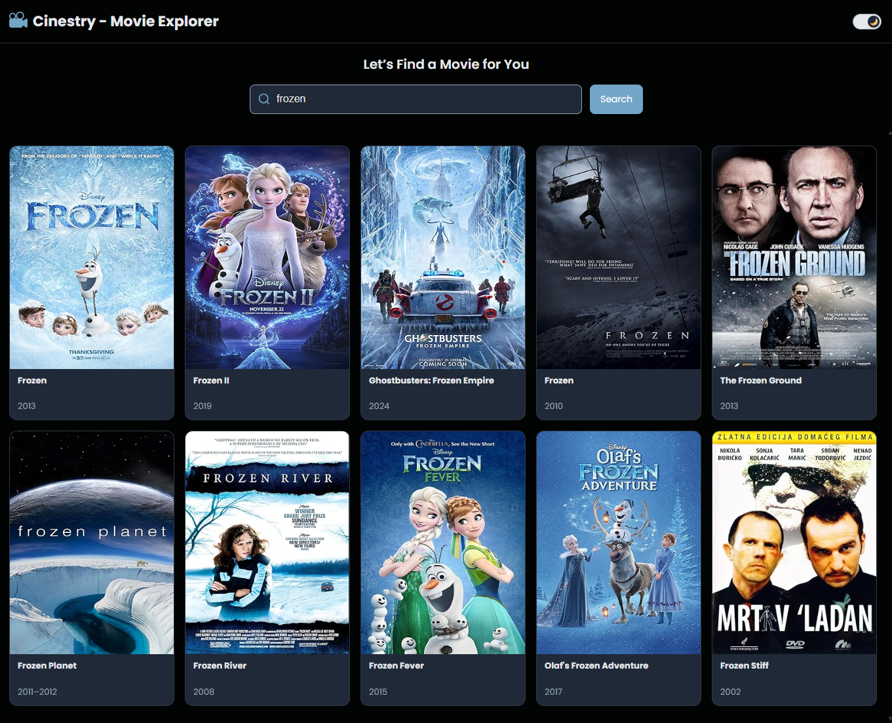

# Cinestry - Movie Explorer 🎬

Cinestry is a React-based web app that allows users to search for movies, view details, and explore ratings using the OMDb API. The app features a responsive UI, dynamic theming (light/dark), and provides an intuitive interface for discovering movie information.

---

## Table of Contents

- [Features](#features)
- [Demo](#demo)
- [Installation](#installation)
- [Usage](#usage)
- [Technologies](#technologies)
- [Testing](#testing)
- [Design Notes](#design)

---

## Features

- Search movies by title using the OMDb API
- View detailed movie information including IMDb rating, genre, runtime, and plot
- Light & dark theme toggle
- Responsive design
- Caching for faster subsequent searches using React Query. (useQuery and local storage)

---

## Demo

Live demo: [https://cinestry.vercel.app/](https://cinestry.vercel.app/)

## Screenshots

### Home Page



## Installation

1. Clone the repository:
   ```bash
   git clone https://github.com/darrenbert73/cinestry.git
   cd cinestry
   ```
2. Install Dependencies
   ```bash
   npm install
   ```
3. Create a .env file in the root with your OMDb API key:
   ```bash
   REACT_APP_OMDB_KEY=your_api_key_here
   ```
4. Start the development server:
   ```bash
   npm start
   ```
5. Open http://localhost:3000 to view it.

## Usage

1. Type a movie name in the search bar and hit Enter

2. Click a movie to see full details

3. Toggle between light and dark themes using the switch

## Technologies

1. React & TypeScript

2. Styled-components

3. Axios for API requests

4. OMDb API

5. Jest & React Testing Library for unit tests

6. Tanstack React Query

## Testing

1. Unit test suites have been created for two components under a seperate folder
   - Search Bar component
   - Movie details overlay component.
2. Run tests with:
   ```bash
   npm test
   ```

## Design

1.  Architecture:
    - React functional components with hooks for state management.

    - Context API for theme management and persisting state in Local storage.

    - Styled-components for modular and theme-aware styling.

    - Axios for API requests.

    - Jest for running unit tests and mocking modules.

    - Responsive layouts using media queries

    - Added a simple validation function for the search term.

    - Caching Strategy - React Query (Primary Cache):
      - Uses useQuery hooks (useMovies, useMovieDetails) to fetch and cache OMDb API results.

      - Each query has a unique cache key (['movies', query], ['movieDetails', id]).

      - Cached results are returned instantly.

      - Data remains “fresh” for a configurable staleTime (10 minutes configured).

      - Once stale, React Query automatically refetches in the background to keep data up to date.

2.  Limitations:
    - Without extra setup, the cache only lives in memory. Refreshing the page or closing the browser clears the cache.
    - API key quota limits (1000/day), occasional inconsistent data ("N/A" values), and lack of advanced filtering.
    - No lazy loading for images (posters), no pagination/infinite scroll for large result sets.
    - No Pagination: The API’s search results only return up to 10 results per page.
